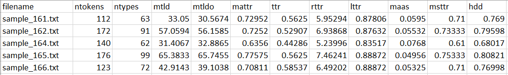

## Tool for the Korean lexical diversity analyser

This python based Korean lexical diversity analyzer calculates lexical diversity indices in Korean texts. This project is built upon the foundation of existing open-source packages, which we greatly appreciate, and offers following key features:

1. Lexical diversity calculation: Utilizes the [TAALED](https://lcr-ads-lab.github.io/TAALED/) package, developed by [Kristopher Kyle](https://kristopherkyle.github.io/professional-webpage/), for calculating lexical diversity indices.

2. Typo correction: Utilizes the [Pywin32](https://github.com/mhammond/pywin32) package to automatically remove typos from raw texts (especially from second language [L2] Korean learners). (*Note*: This feature is only available on Windows.)

3. Tokenization: Integrates [konlpy](https://konlpy.org/en/latest/) or [stanza](https://stanfordnlp.github.io/stanza/tokenize.html) for tokenizing Korean texts before calculating lexical diversity indices. Considering that Korean is an **agglutinative language**, where the tokenization approach significantly impacts the results.

4. Morpheme POS tagging: Offers an option to calculate lexical diversity including only content morphemes or both content and function morphemes. This feature leverages morpheme Part-Of-Speech (POS) tag information from the [konlpy](https://konlpy.org/en/latest/) package.

5. This code is associated with the following paper, which will provide you detailed information about the theoretical background of lexical diversity indices and their application in L2-Korean (writing) assessment:

    - Sung, H., Cho, S., & Kyle, K. (In press). Am empirical evaluation of lexical diversity indices in L2 Korean writing assessment, *Language Assessment Quarterly*.

------------

### How to use this code

#### 1. Input

The Korean texts for analyzing the lexical diversity must be in plain text files with the extension ```.txt```.
You can process multiple files, which are stored in one ```data``` directory.  
e.g. ```data/text1.txt``` ```data/text2.txt``` ```data/text3.txt```

#### 2. Installation

- Install the required packages using:
```
pip install -r requirements.txt
```

- `Mecab` Tokenizer Installation (Optional, only available in Windows)
    - Follow this instruction to install Mecab: 
        - [Korean](https://uwgdqo.tistory.com/363)
        - [English (translated)](https://uwgdqo-tistory-com.translate.goog/363?_x_tr_sl=ko&_x_tr_tl=en&_x_tr_hl=ko&_x_tr_pto=wapp)
- Default Mecab path in the source code is set to: `C:/mecab/mecab-ko-dic`
- You can change the path in the source code directly if you installed Mecab in a different path: see [Source Code](https://github.com/hksyir/klega_lexdiv/blob/2e0d1a8b8bf03abfdbce62d445ce03d7a45fcf09/src/korean_tokenizer.py#L)

*Note*: The typo removal function is available only on Windows environment with Microsoft Office installed. To be able to execute the code on other OS environments, the typo removal function must be off by using the flag ```no-typo-removal```. Refer below for the usage.

#### 3. Execution: Commands and options

- For the basic usage, just run:

```
python src/klega/main.py -i [INPUT_DIR]
```

- This will process your texts in your ```INPUT_DIR``` using (default) ```okt``` tokenizer and save the output in the ```result``` directory, processing contents words only. ```[INPUT_DIR]``` must be a directory where all the text files to process are stored. (e.g. `data/`, refer Section `1. Input`) 

#### 4-1. Option 1: Tokenizers

- To choose different tokenizers, use the argument ```-t```. You can process the same input multiple times using different tokenizers. E.g. To use ```okt``` and ```mecab```, run this command:

```
python src/klega/main.py -i [INPUT_DIR] -t okt mecab
```
- Currently available tokenizers are: ```okt``` ```mecab``` ```hannanum``` ```komoran``` ```kkma``` ```stanza```.
- Each tokenizer has different tokenizting options and different morpheme POS tags, which might affect the lexical diversity calculations. See [Korean POS tags comparison chart](https://docs.google.com/spreadsheets/d/1OGAjUvalBuX-oZvZ_-9tEfYD2gQe7hTGsgUpiiBSXI8/edit#gid=0) (provided from the [konlpy](https://konlpy.org/en/latest/) documentation page).

#### 4-2. Option 2: Processing functional words


- To process both content morphemes and functional morphemes (after the morphemes are automatically tagged by the selected tokenizer), , add ```-f``` flag in the command:

```
python src/klega/main.py -i [INPUT_DIR] -f
```

- To process ONLY content morphemes (after the morphemes are automatically tagged by the selected tokenizer), simply drop the ```-f``` flag:

```
python src/klega/main.py -i [INPUT_DIR]
```

- *Note*: For ```stanza``` tokenizer, ```-f``` must be always added. ```stanza``` does not have an option to extract content words only.

#### 4-2. Option 3: Typo Removal Function

- The function was designed to process L2 Korean texts, which often contain spelling errors that could skew lexical diversity calculations. For example, a Korean learner might mistakenly spell '걸음' (walk) as '거름' (fertilizer), artificially inflating lexical diversity scores. (The automatic typo removal function that we used in this code does not use context information, so it may not catch all misspelled words as we expected.)


##### Turning off the typo removal function (for Mac and Linux)
- Currently, the typo removal function is available only on Windows environment with Microsoft Office installed. To be able to execute the code on other OS environments, the typo removal function must be off by using the flag ```-no-typo-removal```:

```
python src/klega/main.py -i [INPUT_DIR] -no-typo-removal
```

#### 4-3. Option 4: Output directory

- The default output directory is ```result```.
- If you want to change the output directory, use the flag ```-o```:

```
python src/klega/main.py -i [INPUT_DIR] -o [OUTPUT_DIR]
```

##### 5. Example

- For example, if you want to process files in the `input` directory using `hannanum` and `komoran` tokenizers, focusing on content words only, and save the output to the `output` directory, use the following command:

```
python src/klega/main.py -i input -o output -t hannanum komoran
```

### Output
After a successful run, three types of output files are generated: (1) logfile, (2) processed files, and (3) a spreadsheet with lexical diversity values.

#### 1. Logfile
- The logfile, named `log_[yymmdd]_[hhmm].log`, records the configuration of your run, including the selected tokenizer and processed files.

#### 2. Processed Files
- The `processed_data.tsv` file contains:
    - Raw texts in the `raw` column.
    - List of removed typos in the `typo` column.
    - Processed texts in the `processed` column, used for tokenization and lexical diversity calculation.
- This file is useful for reusing the processed texts in other text manipulations or evaluations.
- **Note**: This file is not generated when using the `no-typo-removal` option.

#### 3. Spreadsheet
- Lexical diversity values for each index are saved in a TSV file named `[TOKENIZER]_[FUNCTION_WORD_OPTION].tsv`.
- For instance, `hannanum_content_only.tsv` indicates output from the `hannanum` tokenizer, excluding function words.
- This is a snippet of an exemplary output:



- *Note*: For more information about each index, please refer to the original [TAALED documentation](https://lcr-ads-lab.github.io/TAALED/). Caution is advised as some indices require stability in text length!


### Web Demo

- We included a [web demo version](http://sooyeoncho.pythonanywhere.com) of **K**orean **LE**xico(-**G**rammatical) diversity **A**nalyzer (**KLEGA**), which you can play with a bit. This tool is currently optimized for the Chrome browser on PC.

-----------

### Citation

If you use this code in your research, please cite the following paper:

- Sung, H., Cho, S., & Kyle, K. (In press). Am empirical evaluation of lexical diversity indices in L2 Korean writing assessment, *Language Assessment Quarterly*.


### License
<a rel="license" href="http://creativecommons.org/licenses/by-nc-sa/4.0/"></a><br />This work is licensed under a <a rel="license" href="http://creativecommons.org/licenses/by-nc-sa/4.0/">Creative Commons Attribution-NonCommercial-ShareAlike 4.0 International License</a>.

---------------

Please create a GitHub issue if you have any questions or bug-reports.  
Email to the writers: [Sooyeon Cho](mailto:sy.cho2321@gmail.com) & [Hakyung Sung](mailto:hsung@uoregon.edu)
